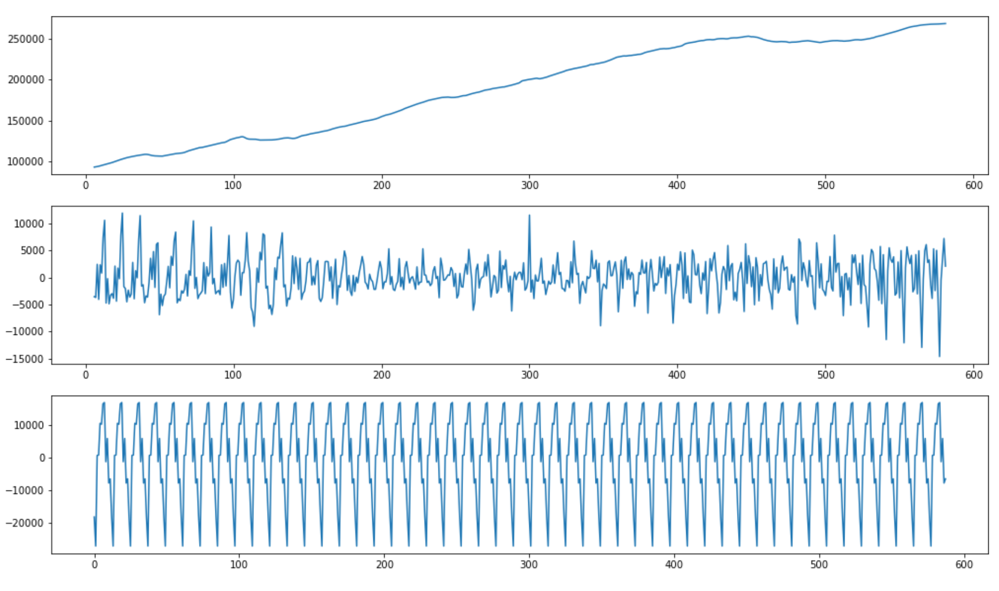
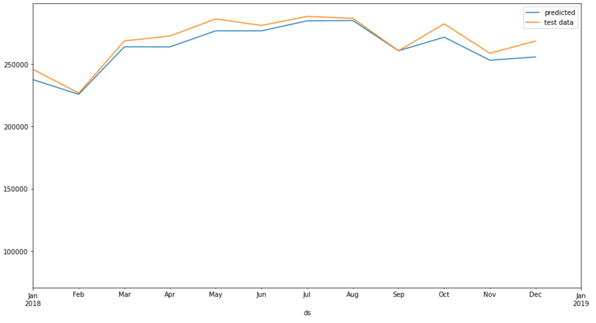

# prophet time series forecasting
Perform forecasting time series using Facebook Prophet 

Data used : 

Plot of Vehicles miles over time dataset
(images/Capture d’écran 2021-04-28 à 16.06.00.png)

Time series seems to be having seasonal component along with trend and residual components.

Original and predicted values of the test set, the model perfom very well.
RMSE Score = 7088.196789682658

